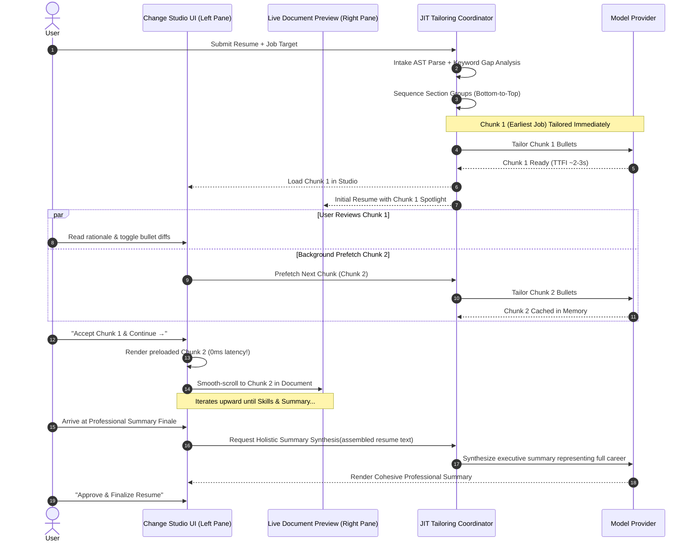

# Section-by-Section Bottom-to-Top Narrative Review Flow with JIT Lazy Loading

## Executive Summary
This design overhauls the resume tailoring review experience into a narrative-driven **Section-by-Section Studio**:
1. **Context Isolation**: Reviews whole experience chunks (e.g. all bullet points for a single job together) in context, rather than disjointed micro-bullet diffs.
2. **Bottom-to-Top Chronological Flow**: Guides the user upward through their career arc: Earlier Roles $\rightarrow$ Recent Roles $\rightarrow$ Skills Alignment $\rightarrow$ **Professional Summary Synthesis**.
3. **Just-In-Time (JIT) Lazy Loading**: Time-to-first-interaction drops to ~2–3 seconds by tailoring only Chunk 1 upfront while a sliding-window background worker prefetches subsequent chunks as the candidate reviews.
4. **Complete Section Auditing**: Every experience entry is accounted for; sections without modifications explicitly state *why* they were preserved (e.g. authentic timeline voice, sufficient existing metrics).
5. **Holistic Career Summary**: The summary at the top synthesizes the candidate's complete career arc, aligning with the entire resume without contradicting any accepted or rejected user choices.
6. **Live Document Synchronization**: Smooth auto-scrolls the right-side resume preview to spotlight the active section, with bi-directional navigation.

---

## 1. System Architecture & Data Flow



---

## 2. Data Structures & State Management

### 2.1 `ResumeSectionGroup` Interface
Added to [`src/app/agent/state.ts`](file:///Users/shaynezamora/documents/resume-tailor/src/app/agent/state.ts):

```typescript
export type SectionGroupType = "experience" | "skills" | "summary" | "other";
export type SectionTailorStatus = "pending" | "tailoring" | "ready" | "reviewed" | "unchanged";

export interface ResumeSectionGroup {
  id: string;                       // e.g. "section-job-2" or "section-summary"
  sectionType: SectionGroupType;
  title: string;                    // e.g. "Google – Senior Software Engineer"
  subtitle?: string;                // e.g. "2021 – Present • Mountain View, CA"
  jobIndex?: number;                // Index in resumeAST.experience
  orderIndex: number;               // 0 = Earliest Job, ..., N-1 = Skills, N = Summary
  status: SectionTailorStatus;      // JIT pipeline state
  auditRationale: string;           // Narrative explanation of changes or reason preserved
  suggestions: ResumeSuggestion[];  // Active suggestions in this chunk
  originalContent: string;          // Original raw content of this chunk
  tailoredContent?: string;         // Tailored text for this chunk
  hasChanges: boolean;              // True if changes proposed; false if preserved as-is
}
```

### 2.2 Extended `AgentState`
```typescript
export interface AgentState {
  // Existing inputs & AST...
  resumeAST?: ParsedResumeForReassemble;
  rawResume: string;
  selectedJobDescription?: string;
  preferences: TailoringPreferences;

  // New section orchestration state
  sectionGroups?: ResumeSectionGroup[];
  activeSectionId?: string;
  sectionCache?: Record<string, ResumeSectionGroup>;
  
  // Existing suggestion outputs...
  suggestions?: ResumeSuggestion[];
  tailoredSummary?: string;
}
```

---

## 3. Backend Implementation & Node Responsibilities

### 3.1 `bulletPlannerNode` ([`src/app/agent/nodes/bulletPlanner.ts`](file:///Users/shaynezamora/documents/resume-tailor/src/app/agent/nodes/bulletPlanner.ts))
- Audits **every** experience entry from bottom to top:
  - If modified: records `bulletIndices` and `auditRationale` (e.g. *"Targeted backend scalability metrics (+40% throughput) and injected Kubernetes and gRPC"*).
  - If untouched: assigns `status: "unchanged"` with an explicit rationale (e.g. *"Foundational role highlights early software engineering tenure; original bullets kept intact to preserve authentic timeline voice"*).
- Establishes the bottom-to-top sequence:
  1. Job $N-1$ (Earliest Role)
  2. ...
  3. Job 0 (Most Recent / Current Role)
  4. Skills Section
  5. Professional Summary (Synthesis)

### 3.2 JIT Chunk Tailoring Endpoint ([`src/app/api/agent/tailor-chunk/route.ts`](file:///Users/shaynezamora/documents/resume-tailor/src/app/api/agent/tailor-chunk/route.ts))
- Tailors an individual section chunk on demand.
- Accepts `sectionGroup`, `resumeContext`, `jobDescription`, and `preferences`.
- Returns updated `suggestions`, `tailoredContent`, and `status: "ready"`.

### 3.3 Summary Synthesis Endpoint ([`src/app/api/agent/synthesize-summary/route.ts`](file:///Users/shaynezamora/documents/resume-tailor/src/app/api/agent/synthesize-summary/route.ts))
- Generates the executive career summary upon arriving at the Summary step.
- Takes the **assembled resume** (incorporating accepted bullets, preserved roles, and skills) along with the target job description.
- Produces a 3–4 sentence executive pitch unifying the entire career arc without contradicting any accepted decisions or omitting key competencies.

---

## 4. Frontend Component Specifications

### 4.1 Narrative Section Reviewer ([`src/app/components/ResumeSuggestionReviewer.tsx`](file:///Users/shaynezamora/documents/resume-tailor/src/app/components/ResumeSuggestionReviewer.tsx))

#### Stepper Progress Header
- Displays visual stage markers:
  - `[✓ 1. Junior Role (Chapman)]` $\rightarrow$ `[● 2. Senior Role (Google)]` $\rightarrow$ `[3. Skills]` $\rightarrow$ `[4. Summary Synthesis]`
- Status icons: Completed (`✓`), In Progress (`●`), Preserved (`🛡️`), Prefetching (`⏳`).
- Fully clickable breadcrumbs allowing candidate to navigate freely.

#### Unified Section Card
- **Header**: Company name, Job title, Timeline, Location.
- **Audit Rationale Banner**:
  - Highlights whether role was enhanced for the target job or preserved for authenticity.
- **In-Context Bullets List**:
  - Direct visual diff: Original phrasing vs. Tailored enhancement.
  - Keyword match badges (`🎯 Keyword`, `📈 Metric`, `⚡ Action Verb`).
  - Quick toggles (`✓ Accept` / `✕ Keep Original`).
  - Inline custom edit modal (`✏️ Edit inline`).
- **Batch Section Actions**:
  - `[✓ Accept Section & Continue →]` (accepts all suggestions in this role and moves to next step).
  - `[↺ Keep Original Section & Continue →]` (reverts all suggestions in this role to original and moves to next step).
  - `[← Previous Section]`.

#### Prefetch Skeleton Loader
- If the candidate advances faster than the background worker (~1–2 seconds), renders a shimmer card: *"Analyzing [Company] experience against target role requirements..."* before smoothly revealing the tailored options.

---

### 4.2 Live Document Synchronization ([`src/app/components/TailoredResumeOutput.tsx`](file:///Users/shaynezamora/documents/resume-tailor/src/app/components/TailoredResumeOutput.tsx))

#### Auto-Scrolling & Spotlight
- Watches `activeSectionId`.
- Invokes `scrollIntoView({ behavior: 'smooth', block: 'center' })` on the matching DOM container in the right pane.
- Applies an active **Spotlight Glow**:
  - Left border accent: `border-l-4 border-indigo-500`.
  - Subtle highlight tint: `bg-indigo-50/20 dark:bg-indigo-950/10`.
  - Smooth 300ms transition.

#### Bi-Directional Focus
- Clicking directly on any section in the live document updates `activeSectionId` in the reviewer studio.
- Live ATS Match Score recalculates dynamically as section choices are accepted or rejected.

---

## 5. Error Handling & Edge Cases

1. **Network or LLM Failure during Chunk Prefetch**:
   - The failing chunk automatically falls back to `"unchanged"` with an explanatory badge: *"Tailoring timed out; original bullets safely preserved"*.
   - A 1-click **"Retry Tailoring"** button allows re-attempting without restarting the session.
2. **Resumes with No Clear Experience Headers**:
   - Fallback section generator uses regex AST boundaries or paragraph diffs to group suggestions cleanly by line blocks.
3. **Out-of-Order Navigation**:
   - An `AbortController` handles canceling or deprioritizing unneeded background prefetches if the user jumps directly to a non-adjacent section.
4. **Summary Re-synthesis after Edits**:
   - If the candidate steps backward to modify an experience bullet after viewing the summary, a badge flags that the summary can be refreshed with 1-click `[↺ Refresh Synthesis]`.

---

## 6. Verification & Testing Plan

### 6.1 Automated Unit Tests
- `tests/unit/agent/section-grouping.test.ts`:
  - Verify bottom-to-top sequence ordering (Job $N-1 \rightarrow \dots \rightarrow$ Job $0 \rightarrow$ Skills $\rightarrow$ Summary).
  - Verify audit rationales exist for every section (including unchanged roles).
- `tests/unit/agent/summary-synthesis.test.ts`:
  - Verify summary synthesis prompt receives complete assembled resume context and respects rejected claims.

### 6.2 Component Tests
- Verify `ResumeSuggestionReviewer`:
  - Renders unified section cards with company/title headers.
  - "Accept Section & Continue" accepts all suggestions in the active group.
  - Stepper reflects `pending`, `tailoring`, `ready`, and `reviewed` states.
- Verify `TailoredResumeOutput`:
  - Auto-scrolls to the target DOM ID on active section change.
  - Clicking a section in the document triggers `onActiveSectionChange`.

### 6.3 Manual End-to-End Verification
1. Start dev server (`npm run dev`).
2. Input a 3+ role resume and a target job description.
3. Verify initial TTFI is ~2–3 seconds and starts on the **earliest job at the bottom of the resume**.
4. Verify unchanged roles display explicit audit preservation reasons.
5. Review each experience chunk, verifying that Chunk 2 is preloaded seamlessly when advancing.
6. Verify the final **Professional Summary Synthesis** unifies the candidate's career narrative without discrepancies.
7. Verify live document smooth-scrolling and spotlight focus.
