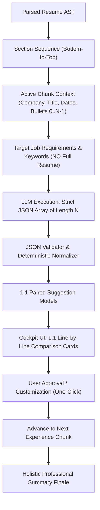

# Isolated Chunk Context & 1-to-1 Line-by-Line Tailoring Design

## Context & Motivation
When candidates tailor their resume against a target job description, cognitive fatigue is the #1 friction point. Currently:
1. The experience bullet tailoring prompt injects the full resume context (`resumeContext: rawResume`), which broadens the hallucination surface and risks cross-tenure context bleed.
2. The model returns free-form bullet text, which is parsed by loose array indexing. If the model outputs fewer or more bullets than the original role, line alignment breaks.
3. The review UI places heavy cognitive burden on the candidate by showing full document previews without a clean, granular 1:1 diff of what changed per line.

This design implements **Approach 1 (Strict 1-for-1 JSON Line-by-Line Schema with Isolated Context Sandboxing)**.

---

## Architecture & Data Flow

---

## EARS Requirements Specification

- **@EARS-1 [Ubiquitous] Context Sandbox Isolation**: The tailoring engine SHALL NOT pass the full resume text into the experience bullet tailoring prompt. The input context SHALL be strictly limited to the active experience entry's company, job title, dates, original bullets, and target job description keywords.
- **@EARS-2 [Ubiquitous] Strict 1-to-1 Mapping**: For an experience entry containing $N$ original bullets, the system SHALL output exactly $N$ corresponding items, guaranteeing every original bullet has an identified 1:1 counterpart without dropped or unmapped lines.
- **@EARS-3 [Ubiquitous] Structured Schema Enforcement**: The chunk tailoring prompt SHALL instruct the model to return a structured JSON array conforming to `ChunkBulletResponse[]` where each object contains `index`, `originalText`, `suggestedText`, `status`, `reason`, and `keywords`.
- **@EARS-4 [When] Requesting Chunk Tailoring**: WHEN `/api/agent/tailor-chunk` receives a `sectionGroup` payload, the system SHALL generate suggestions where `suggestions[i].originalText` strictly matches the $i$-th original bullet of that section.
- **@EARS-5 [When] Rendering Active Experience in Cockpit**: WHEN a user views an experience stage in the Narrative Section Studio, the cockpit UI SHALL render a dedicated 1:1 diff card for each bullet displaying the original line, the tailored line, tactical rationale, and targeted keywords.
- **@EARS-6 [When] Toggling Bullet Status**: WHEN a user clicks "Keep Original" on bullet $i$, the live document preview SHALL instantly restore the exact original text of bullet $i$, and the live ATS match score badge SHALL dynamically re-calculate.
- **@EARS-7 [When] Inline Editing**: WHEN a candidate edits the suggested bullet text and clicks "Save & Accept", the system SHALL update `suggestedText`, mark `status = 'accepted'`, and update the active preview in real time.
- **@EARS-8 [Exception] Malformed LLM Output**: IF the LLM output fails JSON parsing or markdown fence stripping, THEN the system SHALL invoke a deterministic line-matching fallback that pairs lines by line order without dropping original content or returning a 500 error.
- **@EARS-9 [Exception] Bullet Count Discrepancy**: IF the model returns fewer than $N$ items, THEN the system SHALL preserve the missing indices $[M \dots N-1]$ using their original unaltered bullet text with `status = 'unchanged'`.
- **@EARS-10 [Exception] Empty or Unchanged Section**: IF an experience entry has no proposed enhancements, THEN the cockpit SHALL display an "Authentic Original Preserved" badge and allow the user to advance with one click.

---

## Implementation Work Breakdown

1. **Task 1: Prompt Contract & Context Sandbox Refactor**
   - File: `src/app/prompts/tailoringSection.ts`
   - Strip `resumeContext` from `getExperienceBulletsPrompt`.
   - Provide indexed input bullets and mandate JSON output conforming to `ChunkBulletSuggestion[]`.

2. **Task 2: Chunk Endpoint JSON Normalizer & Fallback**
   - File: `src/app/api/agent/tailor-chunk/route.ts`
   - Parse and validate JSON array of length $N$.
   - Implement resilient fallback line-pairing parser if JSON format is broken.

3. **Task 3: Surgical Tailor Node Alignment**
   - File: `src/app/agent/nodes/surgicalTailor.ts`
   - Wire isolated experience sandbox call and ensure 1:1 suggestion pairing.

4. **Task 4: Review Cockpit 1:1 Diff UI**
   - File: `src/app/components/ResumeSuggestionReviewer.tsx`
   - Replace complex wall of text with focused 1:1 bullet comparison cards.
   - Show exact line diffs (Original removed/replaced vs Tailored added/enhanced).

5. **Task 5: Test Suite & Verification**
   - Unit tests for prompt generation, JSON normalizer, and fallback parser.
   - Verify `npx tsc --noEmit`, `npm test`, and `npm run build`.
