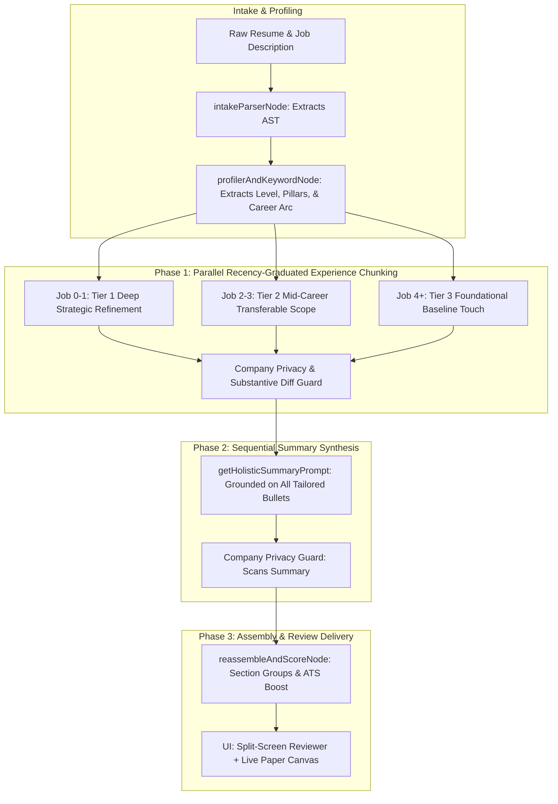

# Universal Recency-Graduated Resume Tailoring Architecture

**Document ID**: SPEC-TAILOR-2026-09-14  
**Status**: Approved / Ready for Implementation  
**Target Branch**: `feature/section-narrative-review-flow`  

---

## 1. Executive Summary & Problem Context

The current resume tailoring pipeline faces several critical limitations:
1. **Siloed Chunking Without Narrative**: Jobs are tailored in parallel isolation with zero shared context, resulting in disjointed local edits rather than a cohesive career trajectory.
2. **Double-Bind Prompting**: Prompts simultaneously instruct the model to never invent facts while demanding quantified percentage metrics and absent keywords. When neither exists in the source text, the model reverts to generic buzzwords ("Spearheaded") or hallucinated percentages ("improving efficiency by 30%").
3. **Flawed Bullet Selection**: Selection logic previously scored bullets based on absent keywords, producing identical gap scores across all bullets and blindly defaulting to the first bullet of the most recent role.
4. **Low Coverage & Premature Summaries**: Targeted mode previously limited rewrites to 3–5 bullets total across the resume, leaving 80%+ of the document untouched, while generating the summary in a vacuum *before* experience bullets were refined.
5. **Domain Bias & Company Leaks**: Phrasing has historically favored software engineering concepts, and lacks defenses against accidentally mentioning the target employer in candidate experience bullets.

This specification redesigns the tailoring engine into a **universal, recency-graduated, full-document tailoring pipeline** that works across **any profession** (healthcare, marketing, sales, finance, operations, education, legal, tech), calibrates depth by career recency, guarantees reusability and strict company privacy, and synthesizes a holistic summary as the final phase.

---

## 2. EARS Requirements Specification

Requirements follow the **Easy Approach to Requirements Syntax (EARS)** standards:

### 2.1 Ubiquitous Requirements (UBI)
* **`REQ-UBI-01` (Universal Domain Support)**:  
  The system SHALL support any industry or profession without hardcoded tech-specific assumptions or terminology.
* **`REQ-UBI-02` (Strict Company Privacy)**:  
  The system SHALL prohibit mentioning the target employer's name anywhere in the tailored bullets or summary unless that exact company name exists in the candidate's original resume experience history.
* **`REQ-UBI-03` (Universal Accomplishment Reusability)**:  
  The system SHALL formulate all tailored accomplishments as transferable, industry-standard professional achievements that remain valid and impactful when submitted to similar or identical roles at other employers.

### 2.2 Event-Driven Requirements (EVT)
* **`REQ-EVT-01` (Universal Profiling & Seniority Tiering)**:  
  WHEN a target job description and job title are ingested, the system SHALL classify the target role into one of five universal seniority tiers (`entry`, `mid`, `senior`, `lead_manager`, `executive`) and extract 2–4 domain-agnostic success pillars.
* **`REQ-EVT-02` (Full-Resume Chunking)**:  
  WHEN experience tailoring begins, the system SHALL chunk the entire employment history and process every job entry across the document.
* **`REQ-EVT-03` (Full-Context & Career Arc Injection)**:  
  WHEN dispatching tailoring prompts for each career role, the system SHALL inject the candidate's synthesized Career Arc and target seniority expectations alongside the job metadata.
* **`REQ-EVT-04` (Sequential Summary Synthesis as Final Step)**:  
  WHEN all experience chunks have completed tailoring, the system SHALL synthesize the Professional Summary last, grounding the executive narrative in the newly assembled, tailored achievements.

### 2.3 State-Driven Requirements (STA)
* **`REQ-STA-01` (Recency-Graduated Depth & Detail)**:  
  WHILE processing job chunks, the system SHALL graduate the depth, refinement, and scope of changes based on role recency:
  * **Tier 1 (Current & Recent Roles, Index 0–1)**: Deepest refinement, strategic decision-making, elevated leadership/ownership, and detailed outcome-driven bullets.
  * **Tier 2 (Mid-Career Roles, Index 2–3)**: Moderate refinement, concise phrasing, focusing on transferable competencies and proven milestones.
  * **Tier 3 (Foundational Roles, Index 4+)**: Lightweight baseline refinement, preserving historical career authenticity without over-detailing.
* **`REQ-STA-02` (Authentic Accomplishment Framing)**:  
  WHILE generating bullet points, the system SHALL prioritize authentic domain scope, stakeholder results, scale, and problem resolution over fabricated percentage metrics.
* **`REQ-STA-03` (Live Document Canvas Synchronization)**:  
  WHILE suggestions are reviewed in the split-view UI, the document canvas SHALL render tailored text for accepted suggestions and original text for pending/rejected suggestions in real time.

### 2.4 Error Handling & Unwanted Behavior Requirements (ERR)
* **`REQ-ERR-01` (Deterministic Company Privacy Guard)**:  
  IF an LLM response mentions the target hiring company or any external organization not present in the candidate's original resume experience history, THEN the system SHALL programmatically scrub or generalize the reference before emitting the suggestion.
* **`REQ-ERR-02` (Substantive Change Validation)**:  
  IF a generated bullet suggestion only modifies punctuation, whitespace, bullet markers, or leaks model thinking/preamble text, THEN the system SHALL discard the suggestion and retain the candidate's original bullet.
* **`REQ-ERR-03` (Empty Experience AST Fallback)**:  
  IF deterministic intake parsing fails to extract employment roles from an unstructured resume, THEN the system SHALL execute bounded LLM parsing fallback to construct the AST before planning bullets.

---

## 3. Architecture & Data Flow

### 3.1 Seniority Tier Definitions
The system identifies the target role level using title and JD semantic markers:
1. **Entry / Associate**: Procedural mastery, learning agility, task diligence, execution precision.
2. **Mid-Level**: Autonomous delivery, end-to-end project ownership, problem diagnosis, core domain competence.
3. **Senior**: Independent strategic decision-making, cross-functional collaboration, mentorship, risk mitigation, operational optimization.
4. **Lead / Manager**: Team guidance, roadmap delivery, stakeholder management, resource prioritization, workflow orchestration.
5. **Director / Executive**: Organizational strategy, fiscal/P&L governance, cross-department alignment, high-stakes outcomes.

### 3.2 Domain-Agnostic Success Pillars
The analyzer extracts 2–4 Core Success Pillars from the target JD. Examples:
* **Healthcare / Nursing**: Patient Acuity Management, Interdisciplinary Coordination, Clinical Compliance.
* **Sales / Business Development**: Pipeline Acceleration, Account Expansion, Executive Relationship Building.
* **Marketing**: Campaign Performance, Audience Segmentation, Brand & Product Positioning.
* **Operations / Supply Chain**: Vendor Governance, Logistics Optimization, SLA & Margin Adherence.
* **Engineering / Tech**: Architecture Resilience, Scale & Throughput, Developer Velocity.

### 3.3 Strict Company Privacy Guard (`companyPrivacyGuard.ts`)
1. **Whitelist Construction**: The guard parses `resumeAST.experience` to extract all legitimate employer names (e.g. `["Acme Corp", "Beta Inc"]`).
2. **Target Identifier**: Identifies the target hiring company name from the JD/job title metadata.
3. **Validation & Scrubbing**: Scans every suggested bullet and summary text:
   - If the target company name or an unvetted employer appears in the output, it is scrubbed and generalized (e.g., replaced with "the organization" or "the enterprise").

---

## 4. Implementation Details & Component Mapping

### 4.1 Node & Utility Responsibilities

| File Path | Primary Responsibilities |
|---|---|
| `src/app/agent/nodes/candidateProfiler.ts` | Detects target seniority level, extracts 2–4 domain success pillars, and formats the 2-sentence Career Arc brief. |
| `src/app/agent/nodes/bulletPlanner.ts` | Configures recency tiers across all resume jobs (`recent_deep`, `mid_career`, `foundational`) instead of blind picking. |
| `src/app/agent/nodes/surgicalTailor.ts` | Dispatches all experience chunks concurrently with recency instructions, then sequentially runs summary synthesis *last*. |
| `src/app/prompts/tailoringSection.ts` | Universal domain-agnostic prompts calibrated by seniority tier and recency; zero forced fake percentages. |
| `src/app/utils/companyPrivacyGuard.ts` | New utility enforcing `REQ-UBI-02` and `REQ-ERR-01` via whitelist matching and automatic scrubbing. |
| `src/app/agent/nodes/reassembleAndScore.ts` | Calculates ATS boost, builds section groups, and validates live document sync. |

---

## 5. Verification & Testing Matrix

| Requirement | Test Suite & Location | Verification Method |
|---|---|---|
| `REQ-UBI-01` | `tests/unit/prompts/universal-domains.test.ts` | Verifies level and pillar extraction across Healthcare, Sales, Finance, Legal, and Tech JDs. |
| `REQ-UBI-02` & `REQ-ERR-01` | `tests/unit/utils/companyPrivacyGuard.test.ts` | Tests scrubbing of target company names and unvetted employers with whitelist validation. |
| `REQ-UBI-03` | `tests/unit/prompts/reusability.test.ts` | Asserts bullets are framed as reusable professional achievements without single-company gimmicks. |
| `REQ-EVT-01` | `tests/unit/agent/seniorityTiering.test.ts` | Validates classification into 5 seniority tiers from title and JD text. |
| `REQ-EVT-02` & `REQ-STA-01` | `tests/unit/agent/recencyGraduatedChunking.test.ts` | Confirms all jobs are processed and Job 0 receives deeper refinement instructions than earlier jobs. |
| `REQ-EVT-04` | `tests/unit/agent/summarySequencing.test.ts` | Confirms summary synthesis runs after experience chunks and incorporates tailored achievements. |
| `REQ-STA-03` | `tests/unit/components/TailoredResumeOutput.test.tsx` | Asserts live document canvas updates only for accepted changes in real time. |
