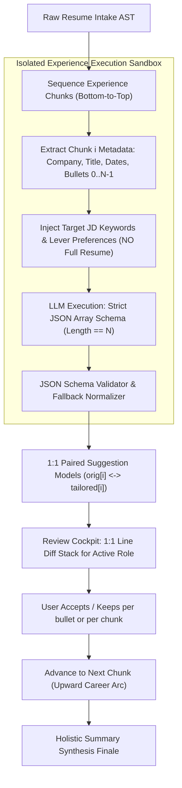

# Isolated Chunk Context & 1-to-1 Line-by-Line Tailoring

## 1. Context & Problem Statement

In the current resume tailoring review flow:
1. **Cognitive Overload**: The user is presented with the entire document simultaneously or with unstructured diffs where it is difficult to isolate what was removed versus what was added.
2. **Context Bleed & Hallucination Surface**: The experience tailoring prompt (`getExperienceBulletsPrompt`) passes `resumeContext: rawResume` (the full 4,000-character resume). Supplying the full resume when tailoring a single past job allows the LLM to hallucinate details across disparate career tenures (e.g., attributing an achievement from 2018 to a 2023 role).
3. **Mismatched Bullet Counts**: The LLM outputs arbitrary bullet lists that are matched to original bullets by loose array indexing. If the LLM generates 3 bullets for an original 5-bullet role, bullets are dropped or misaligned.

We solve this with:
- **Sandbox Context Level**: Each experience entry is treated as an isolated context sandbox. The model sees **only** the target role (company, title, dates, and its specific bullets) alongside the target job requirements.
- **Strict 1-to-1 Line Enhancement**: Every original bullet $b_i$ maps 1-for-1 to an enhanced bullet $b'_i$ via a validated JSON schema.
- **Cognitive Diff Cockpit**: The UI cockpit presents a focused 1:1 comparison stack for the active role, displaying exact line-level before-and-after changes with one-click approval.

---

## 2. System Architecture & Component Flow



---

## 3. Scope In & Scope Out

### In Scope
- **Prompt Refactor**: Update `getExperienceBulletsPrompt` to completely remove `resumeContext: rawResume`. Pass exclusively the target job metadata, numbered bullets, and relevant job description keywords.
- **Strict JSON Contract**: Enforce structured JSON schema output returning an array of length $N$ matching original bullets $[0 \dots N-1]$.
- **Chunk Tailoring Endpoint**: Update `/api/agent/tailor-chunk` to validate and parse the 1:1 JSON output with robust markdown fallback parsing.
- **Surgical Tailor Node**: Update `surgicalTailorNode` to adopt the isolated sandbox and 1:1 bullet mapping.
- **Review Cockpit UI (`ResumeSuggestionReviewer`)**:
  - Replace confusing full-context views with a dedicated **1:1 Bullet Comparison Card Stack** for the active experience stage.
  - Show explicit line diff: `Original (Removed/Replaced)` vs `Tailored (Added/Enhanced)`.
  - Display woven keywords and metrics badges per line.
  - Provide instant inline editing and single-click `Accept` / `Keep Original` toggles.

### Out of Scope
- Modifying PDF generation rendering engine.
- Altering user authentication or Stripe checkout flow.
- Modifying non-experience static sections (e.g. Education, Contact info).

---

## 4. EARS Requirements Specification

### Ubiquitous Requirements
- **@EARS-1 [Ubiquitous] Context Sandbox Isolation**: The tailoring engine SHALL NOT pass the full resume text into the experience bullet tailoring prompt. The input context SHALL be strictly limited to the active experience entry's company, job title, dates, original bullets, and target job description keywords.
- **@EARS-2 [Ubiquitous] Strict 1-to-1 Mapping**: For an experience entry containing $N$ original bullets, the system SHALL output exactly $N$ corresponding items, guaranteeing every original bullet has an identified 1:1 counterpart without dropped or unmapped lines.
- **@EARS-3 [Ubiquitous] Structured Schema Enforcement**: The chunk tailoring prompt SHALL instruct the model to return a structured JSON array conforming to `ChunkBulletResponse[]` where each object contains `index`, `originalText`, `suggestedText`, `status`, `reason`, and `keywords`.

### Event-Driven Requirements
- **@EARS-4 [When] Requesting Chunk Tailoring**: WHEN `/api/agent/tailor-chunk` receives a `sectionGroup` payload, the system SHALL generate suggestions where `suggestions[i].originalText` strictly matches the $i$-th original bullet of that section.
- **@EARS-5 [When] Rendering Active Experience in Cockpit**: WHEN a user views an experience stage in the Narrative Section Studio, the cockpit UI SHALL render a dedicated 1:1 diff card for each bullet displaying the original line, the tailored line, tactical rationale, and targeted keywords.
- **@EARS-6 [When] Toggling Bullet Status**: WHEN a user clicks "Keep Original" on bullet $i$, the live document preview SHALL instantly restore the exact original text of bullet $i$, and the live ATS match score badge SHALL dynamically re-calculate.
- **@EARS-7 [When] Inline Editing**: WHEN a candidate edits the suggested bullet text and clicks "Save & Accept", the system SHALL update `suggestedText`, mark `status = 'accepted'`, and update the active preview in real time.

### Unwanted Behavior / Exception Handling Requirements
- **@EARS-8 [Exception] Malformed LLM Output**: IF the LLM output fails JSON parsing or markdown fence stripping, THEN the system SHALL invoke a deterministic line-matching fallback that pairs lines by line order without dropping original content or returning a 500 error.
- **@EARS-9 [Exception] Bullet Count Discrepancy**: IF the model returns fewer than $N$ items, THEN the system SHALL preserve the missing indices $[M \dots N-1]$ using their original unaltered bullet text with `status = 'unchanged'`.
- **@EARS-10 [Exception] Empty or Unchanged Section**: IF an experience entry has no proposed enhancements, THEN the cockpit SHALL display an "Authentic Original Preserved" badge and allow the user to advance with one click.

---

## 5. Data Contracts

### 5.1 JSON Payload to LLM
```typescript
interface ExperienceChunkPromptInput {
  company: string;
  jobTitle: string;
  dates: string | null;
  bullets: Array<{ index: number; text: string }>;
  targetKeywords: string[];
  jobDescriptionSnippet: string;
  preferences?: TailoringPreferences;
}
```

### 5.2 Structured Output Schema from LLM
```typescript
interface ChunkBulletSuggestion {
  index: number;
  originalText: string;
  suggestedText: string;
  status: "enhanced" | "unchanged";
  reason: string;
  keywords: string[];
}
```

---

## 6. Implementation Plan & Work Breakdown

### Task 1: Prompt Contract & Context Sandbox Refactor
- **Target Files**: `src/app/prompts/tailoringSection.ts`, `tests/unit/prompts/tailoring.test.ts`
- **Actions**:
  - Remove `resumeContext` from `getExperienceBulletsPrompt`.
  - Format input bullets as indexed entries (`[0] ...`, `[1] ...`).
  - Require strict JSON response format conforming to `ChunkBulletSuggestion[]`.
  - Update prompt unit tests.

### Task 2: Chunk Endpoint JSON Normalizer & Fallback
- **Target Files**: `src/app/api/agent/tailor-chunk/route.ts`, `tests/unit/agent/tailor-chunk.test.ts`
- **Actions**:
  - Implement `extractJsonArray` with JSON parse resilience.
  - Implement fallback line-pairing if JSON parsing fails.
  - Ensure length $N$ is strictly guaranteed.
  - Add unit tests verifying 1:1 mapping with mock LLM outputs.

### Task 3: Surgical Tailor Node Alignment
- **Target Files**: `src/app/agent/nodes/surgicalTailor.ts`, `tests/unit/agent/surgical-tailor.test.ts`
- **Actions**:
  - Update `surgicalTailorNode` to call the new prompt without `rawResume`.
  - Populate `ResumeSectionGroup` suggestions with strict 1:1 indexed pairs.

### Task 4: 1:1 Cognitive Diff Cockpit UI
- **Target Files**: `src/app/components/ResumeSuggestionReviewer.tsx`
- **Actions**:
  - Refactor bullet list rendering to display clean 1:1 comparison cards:
    - Top: Original bullet with subtle red/neutral indicator.
    - Bottom: Tailored bullet with green keyword highlights.
  - Add diff highlighting for exact keyword insertions.
  - Ensure single-click actions (`✓ Accept`, `✕ Keep Original`, `✎ Edit`).
  - Eliminate noisy redundant text blocks to minimize cognitive burden.

### Task 5: End-to-End Verification & Build
- **Target Files**: Full test suite & build script
- **Actions**:
  - Run `npm test` across all unit, security, and integration tests.
  - Run `npm run build` and `STRIPE_SECRET_KEY="" npx next build`.
  - Verify zero TypeScript errors via `npx tsc --noEmit`.
