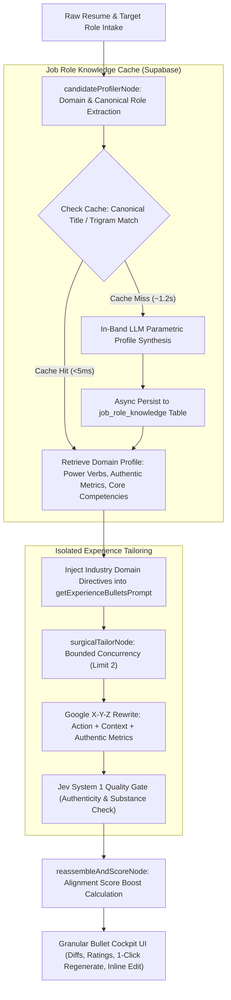

# Universal Category & Domain Taxonomy Bullet Elevation Engine

## 1. Context & Problem Statement

Modern AI resume tailoring tools suffer from three critical deficiencies:

1. **Software & Tech Industry Bias**: Prompts and models default to engineering terminology (*"architected"*, *"refactored"*, *"deployed"*, *"automated"*). When non-technical candidates (e.g., nurse managers, waitstaff, accountants, facilities custodians, commercial pilots, or athletic coaches) tailor their resumes, the output often sounds unnatural, inappropriate, or misaligned with industry standards.
2. **Passive Task-Listing & Lack of Quantified Outcomes**: Most resume bullet points are passive duty descriptions (*"Responsible for..."*, *"Assisted with..."*, *"Handled..."*). They fail to answer the fundamental hiring question: *What was the measurable business or operational impact?*
3. **Fictitious Hallucinations vs. Missing Context**: When an original bullet lacks metrics, naïve AI prompts invent fabricated percentage metrics (*"increased revenue by 34.5%"*), which risks candidate disqualification in interviews. Conversely, candidates frequently omit authentic operational scale (*headcount, covers per shift, facility square footage, patient panel size, flight hours, regulatory audit pass rates*).
4. **Redundant Reprocessing & Lack of Semantic Role Reuse**: Variations of the same role (*"Nursing Lead"* vs. *"Nurse Manager"* vs. *"Clinical Nurse Supervisor"*) are treated as unrelated, missing opportunities to reuse validated, high-impact domain knowledge.

This specification defines the **Universal Category & Domain Taxonomy Bullet Elevation Engine**, introducing:
- A **Universal Domain Taxonomy** calibrated across all economic categories.
- A **Canonical Role Resolver & Knowledge Base** stored in Supabase with sub-5ms cache hits.
- A strict **Google X-Y-Z Bullet Elevation Framework** enforcing authentic industry metrics and banning passive phrasing.
- Integrated **TypeSafe AI Jev System 1 Quality Gatekeeping** per bullet.
- **Granular Bullet-Level Review & Controls** (1-to-1 diff, per-bullet accept/reject, inline edit, single-bullet regeneration).

---

## 2. System Architecture & Flow



---

## 3. Scope In & Scope Out

### In Scope
- **Domain Taxonomy Matrix**: Comprehensive domain rules, native action verbs, and authentic metric dimensions for all major industries (Healthcare, Hospitality/Food Service, Sales/Marketing, Finance/Accounting, Operations/Logistics, Trades/Facilities, Aviation, Athletics/Education, Technology).
- **Supabase Role Knowledge Base**: `job_role_knowledge` table with indexing on `canonical_title`, `industry_category`, and trigram similarity support (`pg_trgm`).
- **Prompt Refactor (`tailoringSection.ts`)**:
  - Dynamic injection of domain-specific power verbs based on detected industry.
  - Ban on subordinate/passive language (*"Responsible for"*, *"Assisted with"*, *"Worked on"*).
  - Google X-Y-Z impact structure mandate (*Accomplished [X], as measured by [Y], by doing [Z]*).
  - Authentic operational metric extraction (physical volume, headcount, time/cycle reduction, compliance standards) without fictitious percentage hallucination.
- **Jev AI Quality Gate Calibrations**: Verify truthfulness and substantive impact per individual bullet.
- **Granular Review Cockpit UI**: Side-by-side before/after view, Jev verification badges, inline edit, and per-bullet regeneration.

### Out of Scope
- Live web scraping or headless browser sandboxing during active tailoring streams (discarded due to 15–30s latency overhead).
- Automated job board application submission (e.g. auto-applying to LinkedIn/Indeed).
- Modifying authentication or payment subscription tiers.

---

## 4. EARS Requirements Specification

### 4.1 Ubiquitous Requirements

- **@EARS-UNI-01 [Ubiquitous] Universal Category Applicability**: The tailoring engine SHALL support candidates from any professional or vocational field—including hourly, licensed, managerial, technical, and trade roles—without imposing tech-specific or corporate jargon onto non-technical resumes.
- **@EARS-UNI-02 [Ubiquitous] Passive Phrasing Elimination**: The prompt engine SHALL strictly prohibit subordinate and passive sentence starters—including *"Responsible for"*, *"Assisted with"*, *"Helped"*, *"Worked on"*, *"Participated in"*, *"Handled"*, and *"Supported"*—and SHALL require every rewritten bullet to position the candidate as the primary driver of the action.
- **@EARS-UNI-03 [Ubiquitous] Google X-Y-Z Formula Alignment**: Every enhanced bullet point SHALL structure achievements according to the Google X-Y-Z framework: **Accomplished [X], as measured by [Y], by doing [Z]**.
- **@EARS-UNI-04 [Ubiquitous] Authentic Metric Extraction & Anti-Hallucination**: The tailoring engine SHALL NOT hallucinate fictitious percentage figures or unverified revenue numbers. The engine SHALL quantify achievements using authentic operational dimensions present in or derivable from the context (e.g., headcount, customer covers, patient panel volume, facility square footage, flight hours, turnaround time, safety records, or compliance ratings).
- **@EARS-UNI-05 [Ubiquitous] Action Verb Variation**: Within any single job role, the system SHALL NOT repeat the same opening action verb across multiple bullet points. Each bullet SHALL open with a distinct, industry-native past-tense verb.

### 4.2 Event-Driven Requirements

- **@EARS-EVT-01 [When] Canonical Role Resolution**: WHEN `candidateProfilerNode` processes the resume and target role, the profiler SHALL extract both the raw role title and a normalized `canonicalRole` (e.g., mapping *"Charge Nurse"* and *"Nursing Lead"* to *"Nurse Manager / Clinical Lead"*).
- **@EARS-EVT-02 [When] Knowledge Base Cache Hit**: WHEN a target role's canonical title or trigram similarity (>0.75) matches an existing record in `job_role_knowledge`, the system SHALL retrieve the cached domain profile (power verbs, metric dimensions, core competencies) in under 15 milliseconds.
- **@EARS-EVT-03 [When] Knowledge Base Cache Miss**: WHEN no matching role exists in `job_role_knowledge`, the system SHALL generate the domain profile via in-band parametric LLM synthesis in under 1.5 seconds and asynchronously persist the record to Supabase.
- **@EARS-EVT-04 [When] Domain Directive Injection**: WHEN `getExperienceBulletsPrompt` is constructed, the prompt engine SHALL inject industry-specific directives and power verbs matching the candidate's verified industry domain.
- **@EARS-EVT-05 [When] Jev Quality Gate Evaluation**: WHEN a rewritten bullet is produced, `surgicalTailorNode` SHALL evaluate the bullet with TypeSafe AI's Jev judge. If `judge.isAuthentic === false` or `judge.isBetterThanOriginal === false`, the system SHALL reject the suggestion and preserve the candidate's authentic original text.
- **@EARS-EVT-06 [When] Granular Inline Editing**: WHEN a user edits a tailored bullet in the review UI, the system SHALL update the document AST and recalculate the live match score badge in real time.
- **@EARS-EVT-07 [When] Single Bullet Regeneration**: WHEN a user triggers single-bullet regeneration with a directive (e.g., *"Make more concise"* or *"Focus on leadership"*), the system SHALL invoke the isolated chunk API for only that specific bullet index without re-running the entire resume pipeline.

### 4.3 State-Driven Requirements

- **@EARS-STA-01 [While] Review Cockpit Active**: WHILE the candidate is reviewing suggestions in the Narrative Review Cockpit, the UI SHALL display a side-by-side diff card for each bullet with the original line, tailored line, Jev verification badge, impact rating (1–5), and targeted keyword pills.
- **@EARS-STA-02 [While] Stream Tailoring Active**: WHILE the LangGraph pipeline is executing, the system SHALL emit SSE progress milestones matching the humanized 5-step stepper with 2.5-second keep-alive heartbeats.

### 4.4 Unwanted Behavior / Exception Handling Requirements

- **@EARS-ERR-01 [Exception] Knowledge Base Storage Failure**: IF a Supabase query or insert to `job_role_knowledge` fails or times out (>1000ms), THEN the tailoring pipeline SHALL fall back seamlessly to in-memory domain defaults without interrupting the user's tailoring request.
- **@EARS-ERR-02 [Exception] Jev Service Timeout or Error**: IF TypeSafe AI Jev calls time out (>1500ms) or fail, THEN the system SHALL fall back to deterministic heuristic validation without throwing an unhandled exception or aborting the stream.
- **@EARS-ERR-03 [Exception] Unrecognized or Novel Role**: IF a role title belongs to an uncommon or unmapped specialization, THEN the profiler SHALL classify it under the closest parent domain (e.g., classifying *"Drone LiDAR Surveyor"* under *"Engineering & Technical Operations"*) and synthesize authentic operational metrics based on context.

---

## 5. Database Schema & Data Contracts

### 5.1 Supabase Table: `job_role_knowledge`

```sql
CREATE EXTENSION IF NOT EXISTS pg_trgm;

CREATE TABLE IF NOT EXISTS job_role_knowledge (
  id UUID PRIMARY KEY DEFAULT gen_random_uuid(),
  canonical_title TEXT NOT NULL,
  industry_category TEXT NOT NULL,
  alternate_titles TEXT[] DEFAULT '{}',
  power_verbs TEXT[] NOT NULL DEFAULT '{}',
  authentic_metric_types TEXT[] NOT NULL DEFAULT '{}',
  core_competencies TEXT[] NOT NULL DEFAULT '{}',
  seniority_expectations JSONB DEFAULT '{}'::jsonb,
  usage_count INT DEFAULT 1,
  created_at TIMESTAMPTZ DEFAULT NOW(),
  updated_at TIMESTAMPTZ DEFAULT NOW()
);

CREATE UNIQUE INDEX IF NOT EXISTS idx_job_role_canonical ON job_role_knowledge (LOWER(canonical_title));
CREATE INDEX IF NOT EXISTS idx_job_role_trgm ON job_role_knowledge USING gin (canonical_title gin_trgm_ops);
CREATE INDEX IF NOT EXISTS idx_job_role_industry ON job_role_knowledge (industry_category);
```

### 5.2 TypeScript Interfaces

```typescript
export type IndustryCategory =
  | 'healthcare'
  | 'hospitality_service'
  | 'sales_marketing'
  | 'finance_accounting'
  | 'operations_logistics'
  | 'trades_facilities'
  | 'aviation_aerospace'
  | 'education_coaching'
  | 'technology_engineering'
  | 'legal_compliance'
  | 'general_business';

export interface JobRoleKnowledge {
  id?: string;
  canonicalTitle: string;
  industryCategory: IndustryCategory;
  alternateTitles: string[];
  powerVerbs: string[];
  authenticMetricTypes: string[];
  coreCompetencies: string[];
  seniorityExpectations?: Record<string, string>;
}

export interface DomainTaxonomyConfig {
  category: IndustryCategory;
  displayName: string;
  primaryVerbs: string[];
  authenticMetricExamples: string[];
  bannedClichés: string[];
  evaluationDirectives: string[];
}
```

---

## 6. Verification & Test Plan

1. **Multi-Industry Unit Test Suite (`tests/unit/prompts/universal-domains.test.ts`)**:
   - Verify bullet rewrites across all 9 industries (e.g., Nurse Manager, Line Cook / Waiter, Commercial Pilot, Janitor, Accountant, Sales Rep, Basketball Coach, Software Engineer).
   - Assert zero occurrence of software-engineering jargon (*"architected"*, *"refactored"*) on non-technical roles.
   - Assert 100% elimination of banned passive openers (*"Responsible for"*, *"Assisted with"*).
2. **Canonical Role Resolution Test (`tests/unit/services/job-knowledge.test.ts`)**:
   - Verify fuzzy matching resolves *"Nursing Lead"* and *"Clinical Care Supervisor"* to *"Nurse Manager"*.
   - Verify database cache hit latency is sub-15ms.
3. **Jev Quality Gate Rejection Test**:
   - Verify suggestions with fabricated numbers or cosmetic-only synonym swaps are rejected by the gatekeeper.
4. **End-to-End Build & Stream Verification**:
   - Full test suite passes 100% (`npm test`).
   - Clean Next.js build (`npm run build`).
